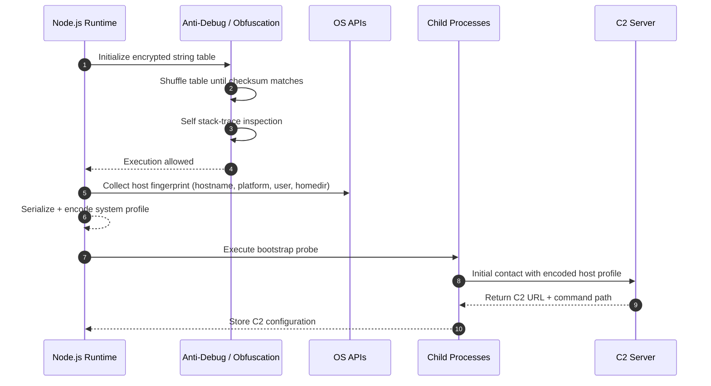
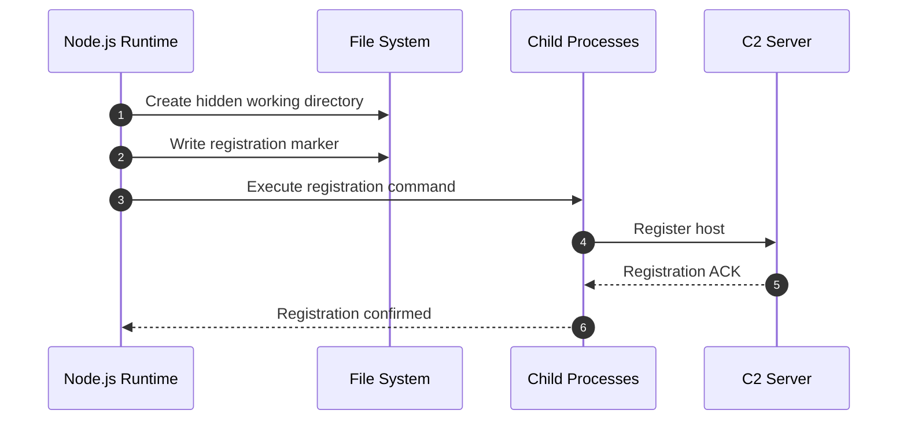
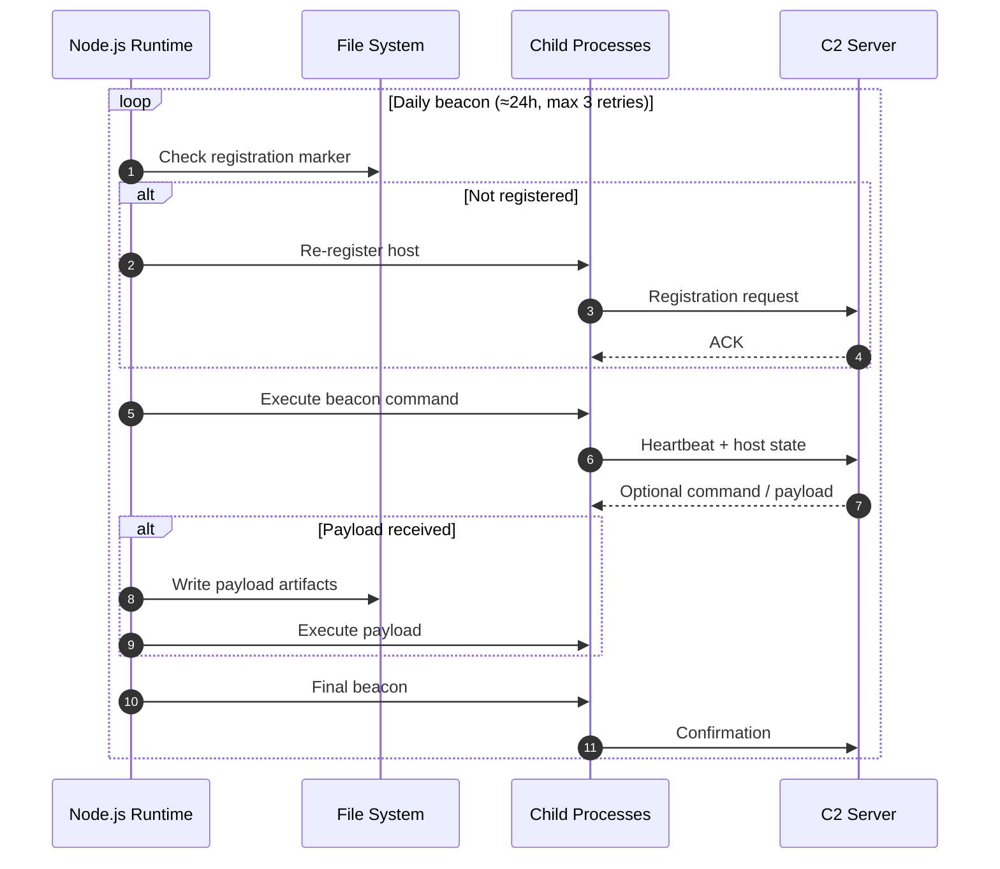

# Lab 01: Malicious Script Analysis

## Purpose

Analyze a malicious Node.js script found in a boobytrapped repository. 

## Input

The input file is extracted from:
- **Source**: [`../inputs/boobytrapped_repo/next.config.js`](../../inputs/boobytrapped_repo/) 

- **File**: [`../input/initial-script.min.js`](../input/initial-script.min.js) - The original, minified, version of the malicious script

## Lab Steps

### Step 1: Beautify the Script

**Command** (run this manually or copy and paste):
```bash
cd labs/lab-01-initial-script/scripts
chmod +x 01-beautify.sh
./01-beautify.sh
```

### Step 2: Examine the Code

Take a look at [`../output/initial-script.js`](../output/initial-script.js) to see the script with "proper" indentation and readability.

### Step 3: LLM Analysis

**Prompt**:
> "Can you analyze this JavaScript file and add comments explaining what each method and block does, in a superficial way? Also infer what the real names of constants, variables, and methods would be, and add those inferred names as comments. Only use comments, no additional text."

You can try yourself with your preferred AI, your result should looks similar to mine at [`initial-script-commented.js`](initial-script-commented.js) contains the analysis with inferred names and explanatory comments. 

## Final Step: Execution Flow Diagrams

The script behavior can be split into **three distinct execution phases**, each represented by a separate sequence diagram.

### 1. Bootstrap & Host Fingerprinting

**File:** `01_seq_bootstrap_and_host_fingerprinting.jpg`

Covers initialization, anti-analysis logic, host fingerprint collection, and the initial bootstrap contact used to retrieve C2 configuration.



---

### 2. Host Registration

**File:** `02_seq_host_registration.jpg`

Shows the one-time registration logic and creation of filesystem markers used as execution state.



---

### 3. Beaconing Loop

**File:** `03_seq_beaconing_and_persistence_loop.jpg`

Represents the in-memory, interval-based beaconing logic executed while the Node.js process remains alive.


