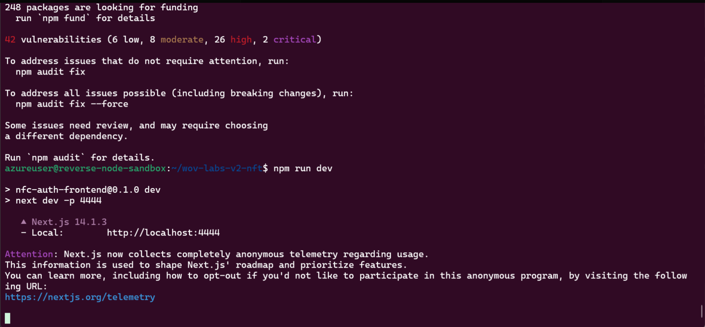
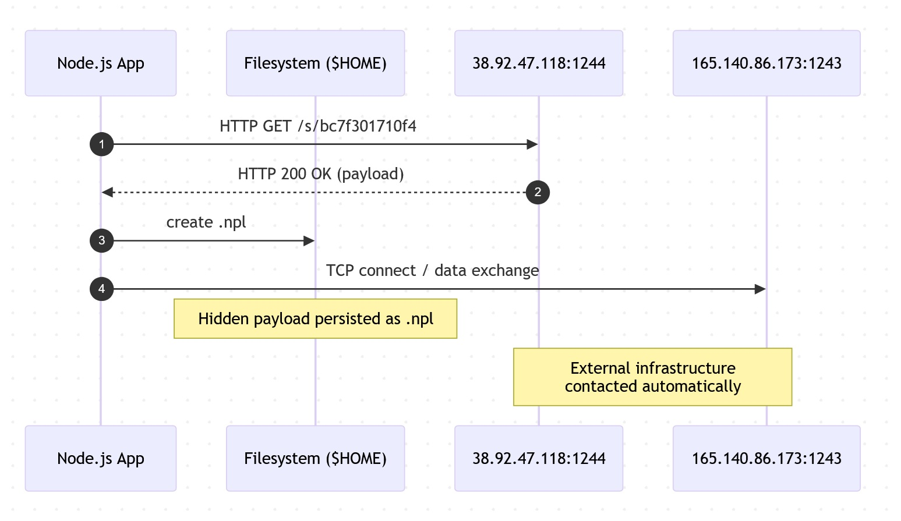

# Lab 03 - Runtime Observation

This lab documents a **single execution** of the repository inside a disposable VM, instrumented to observe:

* Network traffic
* Filesystem changes
* Process activity

## Phase 1 - Prepare

Before executing anything, three monitoring scripts were started.

### 1. Network capture

```bash
sudo tshark -i any -w capture.pcap
```

Artifact produced:

* `$HOME/capture.pcap`


### 2. Filesystem change tracking

```bash
#!/usr/bin/env bash
set -euo pipefail

HOME_DIR="${HOME:?HOME not set}"
LOGFILE="$HOME_DIR/fs-watch.log"

# Remove previous log to avoid noise
rm -f "$LOGFILE"

# Watch HOME but exclude the log file itself
inotifywait -m -r \
  --exclude "$(basename "$LOGFILE")$" \
  -e create \
  -e move \
  -e delete \
  -e close_write \
  --format '%T %e %w%f' \
  --timefmt '%s' \
  "$HOME_DIR" \
  > "$LOGFILE"

```

Artifact produced:

* `$HOME/fs-watch.log`

---

### 3. Process snapshots

```bash
#!/usr/bin/env bash
set -euo pipefail

OUT="ps-watch.log"
rm -f "$OUT"

while true; do
  echo "### $(date -u +%s)"
  ps -eo pid,ppid,user,cmd --no-headers
  sleep 2
done >> "$OUT"
```

Artifact produced:

* `$HOME/ps-watch.log`

---

## Phase 2 - Execute

With monitoring active:

```bash
git clone <repo>
cd <repo>
npm install
npm run dev
```



---

## Phase 3 - Observe

After stopping execution, the system was inspected using the following commands.
The **exact outputs** captured at the time are preserved under `manual_logs/`.

---

### Filesystem inspection

Commands used:

```bash
find ~ -type f -printf '%T@ %p\n' | sort -n | tail -n 20
```

Output:

* [`manual_logs/find_1_output.txt`](manual_logs/find_1_output.txt)

---

```bash
find ~/.config ~/.vscode ~/.local /tmp -type f -printf '%T@ %p\n' | sort -n | tail -n 30
```

Output:

* [`manual_logs/find_2_output.txt`](manual_logs/find_2_output.txt)

---

### Network inspection

Commands used:

```bash
tshark -r capture.pcap -Y 'frame.time_relative < 795.45' \
  -T fields -e ip.dst | sort | uniq -c | sort -nr
```

Output:

* [`manual_logs/tshark_1_output.txt`](manual_logs/tshark_1_output.txt)

---

```bash
tshark -r capture.pcap \
  -Y 'ip.addr == 38.92.47.118 || ip.addr == 165.140.86.173 || ip.addr == 103.70.115.38' \
  -T fields -e frame.time -e ip.src -e ip.dst -e tcp.port -e udp.port -e frame.len -e _ws.col.Info
```

Output:

* [`manual_logs/tshark_2_output.txt`](manual_logs/tshark_2_output.txt)


## Core Findings



From the runtime execution and postmortem inspection:

- **C2 / external IPs contacted**
  - `38.92.47.118` - TCP/1244, HTTP `GET /s/bc7f301710f4` → `HTTP/1.1 200 OK` (payload delivery)  
    See: [`manual_logs/tshark_2_output.txt`](manual_logs/tshark_2_output.txt)
  - `165.140.86.173` - TCP/1243 communication observed  
    See: [`manual_logs/tshark_2_output.txt`](manual_logs/tshark_2_output.txt)
  - `103.70.115.38` - inbound SSH handshake attempt to the VM (`SSH-2.0-libssh_0.11.1`)  
    See: [`manual_logs/tshark_2_output.txt`](manual_logs/tshark_2_output.txt)

- **Local artifact created**
  - Hidden file dropped in `$HOME`: `.npl`  
    See: [`manual_logs/find_1_output.txt`](manual_logs/find_1_output.txt)
